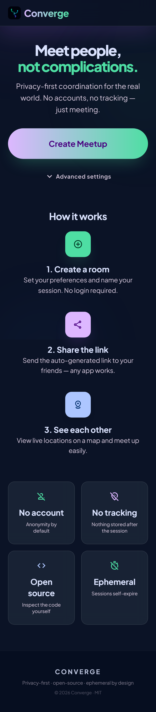
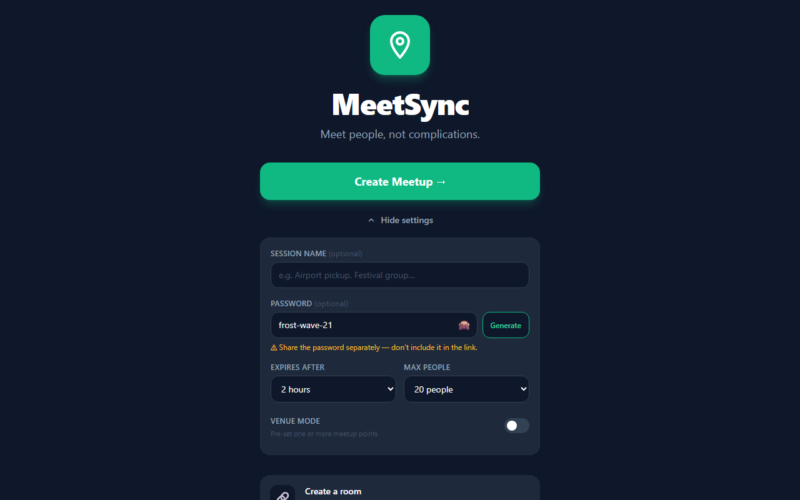
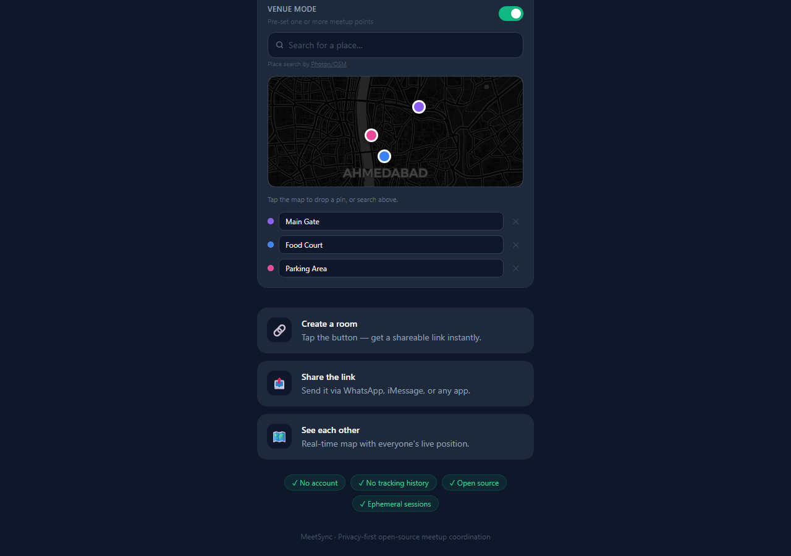
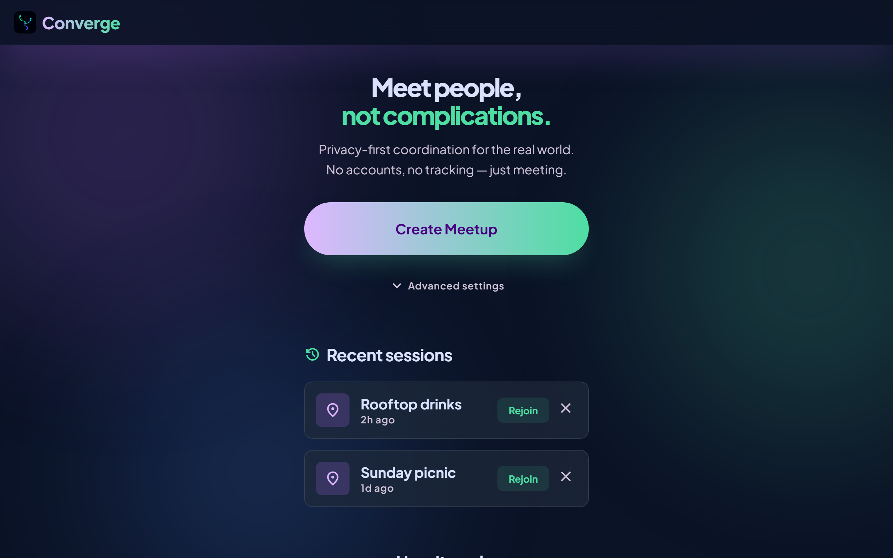
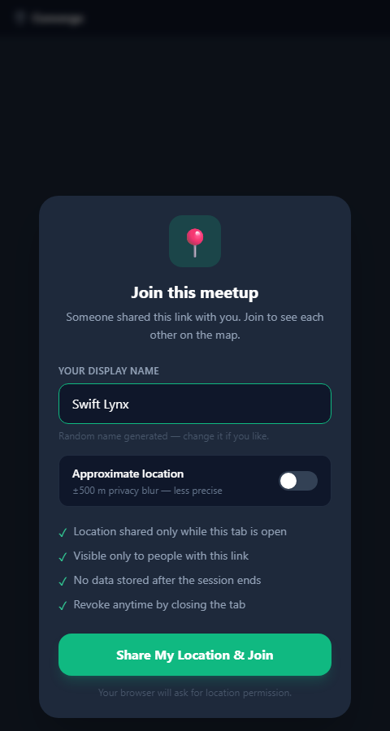
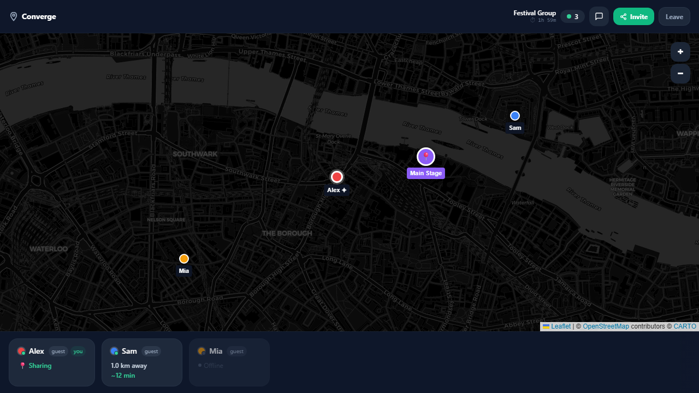
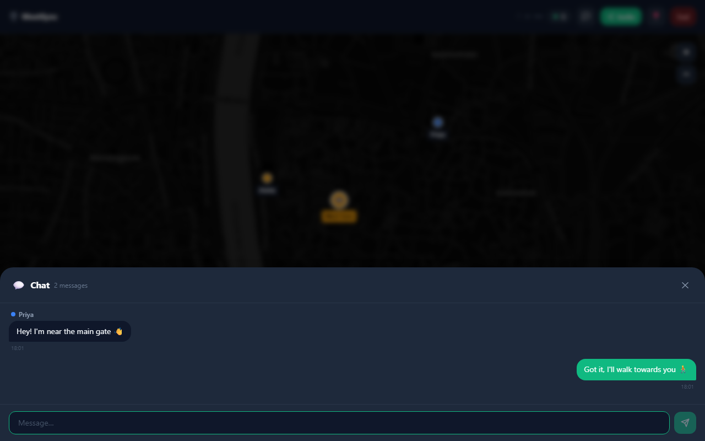
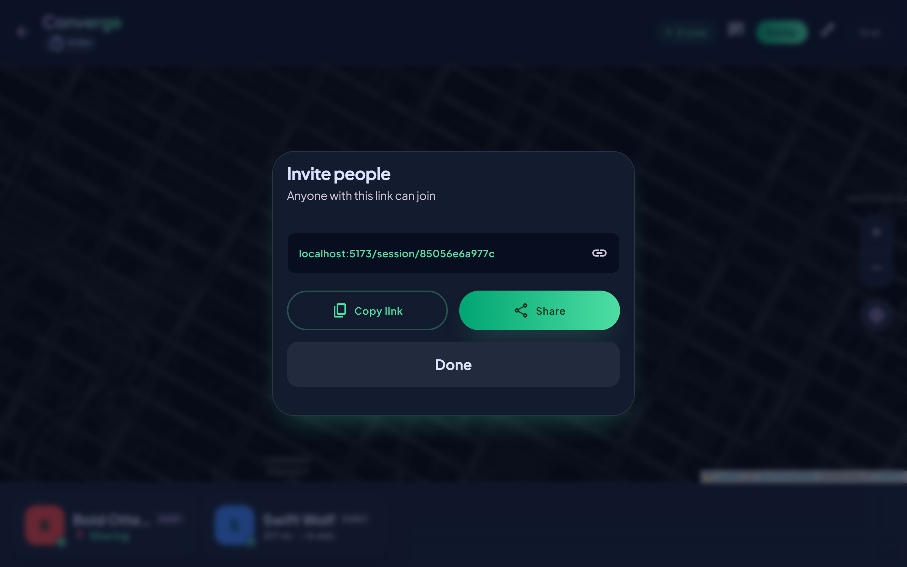

<div align="center">


# Converge

### Meet people, not complications.

**Privacy-first, open-source mutual live location sharing for real-world meetups.**

[](https://opensource.org/licenses/MIT)
[](https://nodejs.org)
[](https://react.dev)
[](https://socket.io)
[](https://www.typescriptlang.org)

[Live Demo](https://meetsync-4udi.onrender.com) · [Report Bug](https://github.com/Naman-Devnani/Converge/issues) · [Request Feature](https://github.com/Naman-Devnani/Converge/issues)

</div>

---

## The Problem

Meeting someone in real life still looks like this:

> "Where are you?" → "I'm 5 minutes away." → "Which gate?" → "Near the entrance." → "I can't see you." → ...

This happens at **airports, malls, concerts, festivals, weddings, college campuses, first dates, group trips** — anywhere two or more people need to physically find each other.

Existing apps like Google Maps and WhatsApp location sharing weren't built for this. They're one-way, permanent, and require too many steps.

---

## The Solution

**Create a temporary meetup room → share a link → everyone approves location access → see each other live on the same map.**

```
"Let's meet."  →  [Share link]  →  See each other in real time
```

No endless texting. No permanent tracking. No app install. Just — meet.

---

## Screenshots

| Home | Advanced Settings |
|---|---|
|  |  |

| Venue Mode | Session History |
|---|---|
|  |  |

| Join / Consent | Live Map |
|---|---|
|  |  |

| In-Session Chat | Invite / Share |
|---|---|
|  |  |

---

## Features

| Feature | Description |
|---|---|
| **Mutual live tracking** | Everyone in the session sees each other's real-time position |
| **Smart ETA** | Live distance and estimated time to meetup for each participant |
| **Venue midpoint** | "Meet here" marker auto-placed at the centroid of all participants |
| **Venue mode** | Host can pre-set up to 5 named meetup points (searchable via Photon/OSM) before the session starts; venue pins appear on everyone's map |
| **In-session chat** | Group chat panel with unread badge — no phone numbers needed |
| **Optional password** | Password-protect sessions; memorable generated passwords (e.g. `amber-peak-44`) |
| **Approximate mode** | Optional ±500 m grid-snap blur; a per-session random jitter prevents cross-session re-identification even when two people share a location |
| **Arrived alerts** | Notification + haptic when someone reaches within 80 m of you |
| **Custom expiry** | Sessions expire in 1–24 h (default 2 h), or 10 min after everyone leaves |
| **Participant limit** | Set max 2–50 people per session (default 20) |
| **Online/offline status** | Participant dot goes grey on disconnect, removed after 30 s grace period |
| **Host/guest labels** | Each participant card shows their role so everyone knows who created the session |
| **End / Leave session** | Host can end the session for everyone; guests can leave explicitly at any time |
| **Session history** | Last 5 sessions saved locally — rejoin with one tap |
| **Native share sheet** | Uses Web Share API on mobile (any app); WhatsApp deeplink fallback on desktop |
| **No install needed** | Web-first — share a link, open in browser, done |
| **PWA ready** | Add to Home Screen on iOS and Android |
| **Open source** | Transparent codebase — no dark patterns, no data selling |

---

## How It Works

```
┌─────────────┐     share link     ┌─────────────┐
│   Alice     │ ──────────────────▶│    Bob      │
│  creates    │                    │   joins     │
│  session    │                    │  session    │
└──────┬──────┘                    └──────┬──────┘
       │  consents to location            │  consents to location
       ▼                                  ▼
  Alice's pin                          Bob's pin
       │                                  │
       └──────────── Live Map ────────────┘
                  Both see each other
                  Distance + ETA shown
                  Midpoint "Meet here" marker
                  "Bob has arrived!" at 80 m
```

1. **Create** — tap "Create Meetup", optionally set a name / password / expiry
2. **Share** — send the link via WhatsApp or copy it; share the password separately if set
3. **Consent** — each person approves location sharing (browser prompt)
4. **Meet** — live map shows everyone moving in real time, chat panel available; host can end the session for all, guests can leave at any time
5. **Done** — close the tab, leave, or end the session — no trace left

---

## Tech Stack

```
Frontend                    Backend
────────────────────        ────────────────────
React 18 + TypeScript       Node.js + Express
Vite 5                      Socket.io 4
Tailwind CSS 3              In-memory session store
react-leaflet 4             TypeScript
CartoDB dark map tiles
```

**Why these choices?**
- **No database** — sessions are ephemeral by design. Nothing to breach.
- **OpenStreetMap / CartoDB** — free map tiles, no API key, no third-party tracking
- **Socket.io** — battle-tested real-time WebSocket library
- **Web-first** — geolocation works in any modern browser over HTTPS

---

## Getting Started

### Prerequisites

- Node.js 20+ (deployment pins 20.11.0 via `render.yaml`)
- npm (bundled with Node.js)

### Local Development

```bash
# 1. Clone the repo
git clone https://github.com/Naman-Devnani/Converge.git
cd Converge

# 2. Install all dependencies (workspaces)
npm install

# 3. Start both servers concurrently
npm run dev
```

| Service | URL |
|---|---|
| Client (React + Vite) | http://localhost:5173 |
| Server (API + Sockets) | http://localhost:3001 |

> **Note:** Vite automatically proxies `/api` requests from `:5173` to `:3001` (see `client/vite.config.ts`), so you never need to hardcode the server URL in the frontend.

### Test with multiple people locally

Open **two or more browser tabs** at `http://localhost:5173` — each tab simulates a different user. All will appear on the map once location is granted.

---

## Deployment (Render — Free)

This repo includes a `render.yaml` for one-click deployment.

### Steps

1. Push this repo to GitHub
2. Sign up at [render.com](https://render.com) (no credit card required)
3. Click **New +** → **Blueprint**
4. Connect your GitHub account → select `Converge`
5. Click **Apply**

Render will automatically:
- Install dependencies (including devDependencies for the build)
- Build the React client with Vite
- Compile the TypeScript server
- Serve everything from `node server/dist/index.js`

> **Why HTTPS matters:** Browsers only allow geolocation on secure origins (HTTPS or localhost). Without it, location sharing won't work on real devices.

### Environment Variables

No secrets required. The only env vars used at deploy time:

| Variable | Value | Notes |
|---|---|---|
| `NODE_ENV` | `production` | Set in `render.yaml` |
| `PORT` | Set automatically by Render | Server binds to this port |
| `ALLOWED_ORIGIN` | e.g. `https://your-app.onrender.com` | Optional. Comma-separated list of allowed CORS origins in production. Leave unset when the client and server are served from the same origin (the default Render setup — Express serves the built client). Required only if you deploy the frontend and backend on separate domains. |

---

## Project Structure

```
Converge/
├── client/                    # React frontend (Vite)
│   ├── public/
│   │   ├── manifest.json      # PWA manifest
│   │   └── icons/icon.svg     # App icon
│   └── src/
│       ├── pages/
│       │   ├── Home.tsx            # Landing page + advanced settings
│       │   └── Session.tsx         # Live map session
│       ├── components/
│       │   ├── MeetMap.tsx         # Leaflet map, live markers, midpoint
│       │   ├── ConsentModal.tsx    # Privacy consent + name picker
│       │   ├── PasswordModal.tsx   # Guest password entry
│       │   ├── ChatPanel.tsx       # In-session group chat
│       │   ├── ShareModal.tsx      # Copy link + password, WhatsApp share
│       │   ├── VenuePicker.tsx     # Host venue search + pin management
│       │   └── ParticipantList.tsx # Distance, ETA, online status cards
│       ├── utils/
│       │   ├── geo.ts             # Haversine distance, ETA, privacy blur
│       │   ├── password.ts        # Memorable password generator
│       │   ├── sanitize.ts        # Input sanitisation helpers
│       │   ├── history.ts         # LocalStorage session history
│       │   └── leaflet-setup.ts   # Leaflet default-icon fix (imported once at app root)
│       ├── socket.ts          # Socket.io client singleton
│       └── types.ts           # Shared TypeScript types
│
├── server/                    # Node.js backend
│   └── src/
│       ├── index.ts           # Express + Socket.io server
│       ├── sessions.ts        # In-memory session store + password hashing
│       └── types.ts           # Shared TypeScript types
│
├── render.yaml                # One-click Render deployment
└── package.json               # npm workspaces root
```

---

## Privacy Design

Converge was built with privacy as a core constraint, not an afterthought.

- **Mutual consent** — nobody can see you without your explicit approval
- **No accounts** — no email, no password, no profile
- **No persistent storage** — locations exist only in RAM during the session
- **Auto-expiry** — sessions self-destruct after 1–24 h (default 2 h) or 10 min of inactivity
- **Approximate mode** — opt-in ±500 m grid snap with per-session random jitter; shares your area, not your exact position, and prevents cross-session location correlation
- **Password separation** — session passwords are never included in the shareable link or WhatsApp message; they must be shared through a separate channel
- **Open source** — the entire codebase is auditable. No hidden telemetry.

---

## Roadmap

- [ ] AI-powered meetup point suggestions for crowded venues
- [ ] Custom approximate radius (beyond fixed 500 m)
- [ ] Self-hosting guide (Docker)
- [ ] Native mobile apps (React Native)

---

## Contributing

Contributions are welcome! This is an open-source project built for people, not profit.

```bash
# Fork the repo, then:
git checkout -b feature/your-feature
git commit -m "Add your feature"
git push origin feature/your-feature
# Open a Pull Request
```

Please open an issue first for major changes.

---

## Credits

| Contributor | Role |
|---|---|
| [Naman Devnani](https://github.com/Naman-Devnani) | Creator & maintainer |
| [Claude](https://claude.ai) (Anthropic) | AI pair programmer — architecture, security hardening, bug fixes |

---

## License

MIT © [Naman Devnani](https://github.com/Naman-Devnani)

---

<div align="center">

**Built for people — not surveillance capitalism.**

*Simple. Temporary. Private. Open-source.*

</div>
